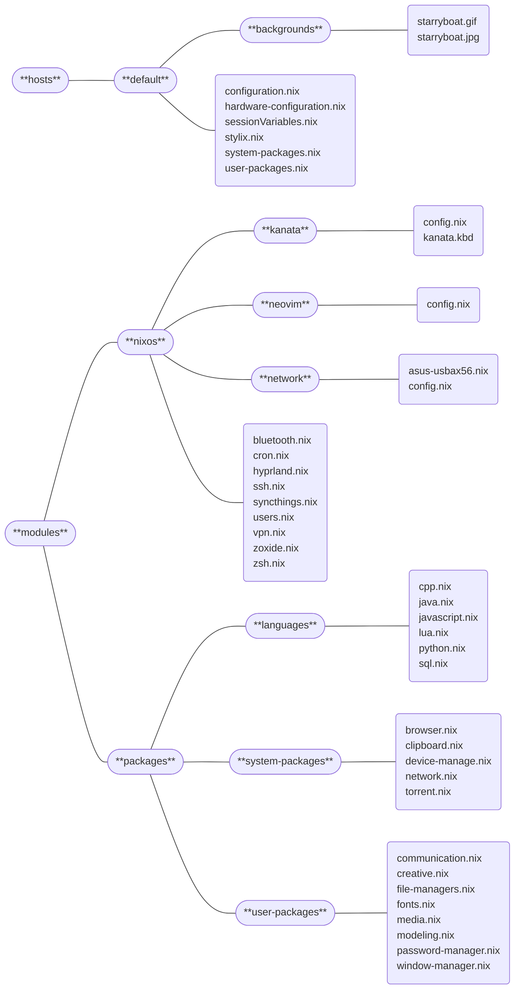

# My [NixOS](https://nixos.org/download/) Config
<kbd>***NixOS Config Status***: *Incomplete*</kbd>

Welcome to my NixOS Config! It represents the aggregate sum of my NixOS knowledge after I began using it on February 9th, 2025. Since then, my config has gone through several stages of cluttering and de-cluttering, reorganization and neglection until it arrived at the state it is in today. As of right now, it is—and will likely remain—an active config.

> [!note]
> This is <ins>*my*</ins> NixOS Config. It’s not perfect, but that’s what I like about it. As I learn and develop my system, these files will change frequently. Right now, I am a “learner;” I hope to eventually become “learned.”
> >“*…to learn is not to know; there are the learners and the learned. Memory makes the one, philosophy the other.*” ~ Abbé Faria, *[The Count of Monte Cristo](https://www.aliceandbooks.com/book/the-count-of-monte-cristo/alexandre-dumas-pere/254)*

# Philosophy
In my usage of NixOS, I have noticed that I often forget about configuration changes[^1], and my packages sometimes get misplaced or installed twice[^2]. After many headaches, I have concluded that the following core tenets work best for me:
- Separate different “functions” out into their own respective modules
- Include unique `configuration.nix`, `home.nix`, `sessionVariables.nix`, `stylix.nix`, `system-packages.nix`, and `user-packages.nix` files for each host[^3]

# Structure
The structure of *this here config* is subject to frequent changes. In fact, there is very little chance that the structure listed below is accurate. Despite this, the fundamentals and principles behind the below structure should be accurate. If there is any major refactoring or restructuring of my config, I will update this to match.
## Graph Layout

[^1]: Often they remain incomplete (*thanks ADHD*), or I flat-out forget them. Often this results in mysterious conflicts that can take hours to track down.

[^2]: After optimizing my config, I have found that installing the same package as a `system-package` and a `user-package` result in not good things. There are also a few packages that can be “enabled” instead of installed. I’m unsure of what would happen if you install the “package version” of a program that you have *enabled.*

[^3]: This way each unique host can utilize the benefits of separating out each “function” into distinct modules. For example, a “default” host can have all the necessities installed and a “art” host can have many of the same features as the “default” host with the addition of other programs.
